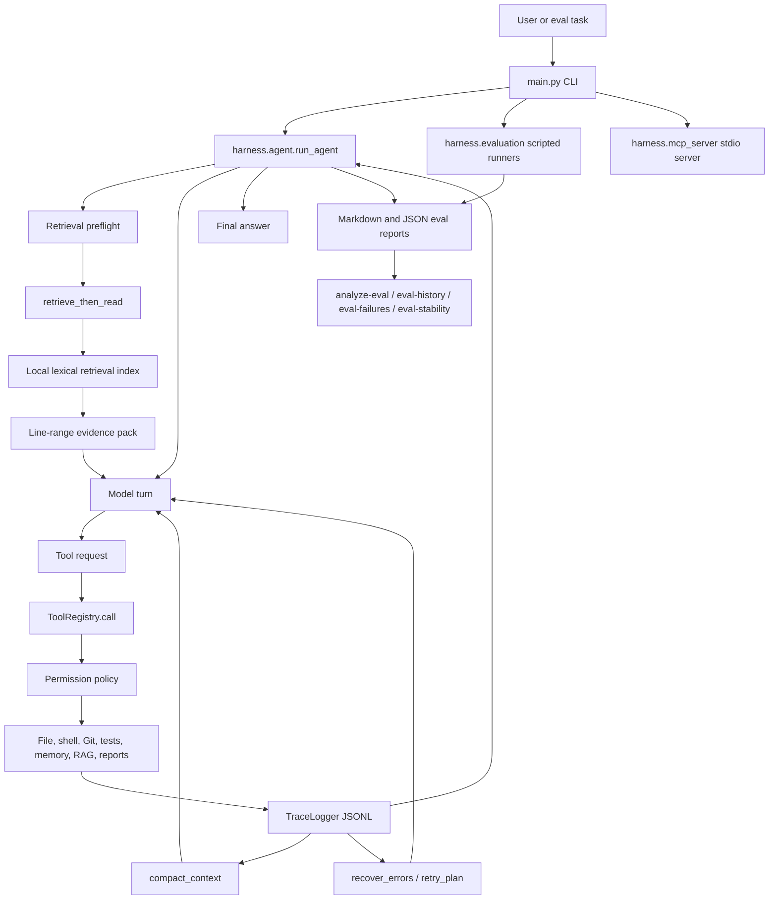
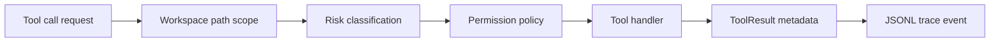
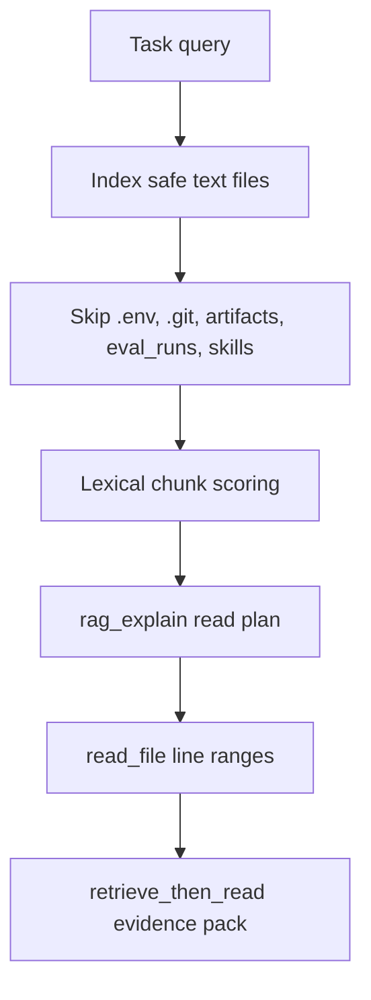
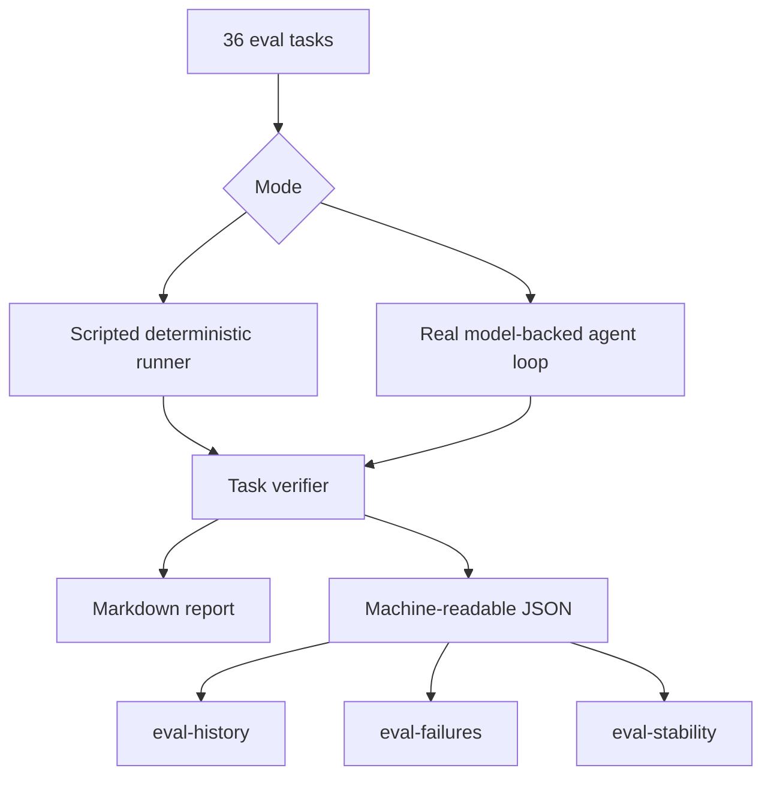
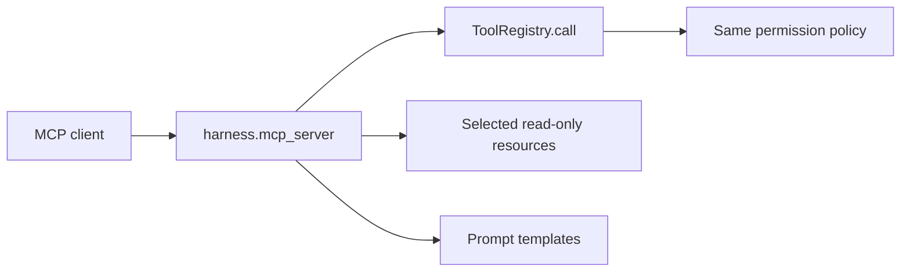

# Architecture

This project is a small coding-agent harness for repository maintenance. The model chooses actions; the harness owns tools, context loading, permissions, execution, traces, and evaluation.

## System Overview

## Runtime Flow

1. A user command or eval task enters through `main.py`.
2. Agent mode builds a `ToolRegistry` and starts `harness.agent.run_agent()`.
3. If retrieval is enabled, the agent preloads a `retrieve_then_read` evidence pack before the first model turn.
4. The model returns either text or a tool request.
5. Every tool request goes through `ToolRegistry.call(...)`, which applies permission policy before dispatching.
6. Tool results are written to append-only JSONL through `TraceLogger`.
7. Failed tools can trigger `retry_plan` feedback; long traces can be summarized with `compact_context`.
8. Eval runs verify the final workspace state and write Markdown/JSON reports.
9. Analysis CLIs convert JSON reports into trend, failure, and stability dashboards.

## Main Modules

| Module | Role |
|---|---|
| `main.py` | CLI entry point for agent runs, evals, report analysis, trace rendering, demos, and MCP. |
| `harness/agent.py` | Model-driven loop, retrieval preflight, tool-result feedback, max-turn context compaction. |
| `harness/tools.py` | Permission-checked tool registry and tool implementations. |
| `harness/retrieval.py` | Local lexical chunk retrieval, read-plan generation, safe path filtering. |
| `harness/evaluation.py` | Scripted and real-agent benchmark runners, task fixtures, verifiers, report generation. |
| `harness/eval_analysis.py` | Eval comparison, trend history, failure dashboard, and repeated-run stability reports. |
| `harness/mcp_server.py` | MCP stdio server exposing selected tools, resources, templates, and prompts. |
| `harness/trace.py` | Append-only JSONL trace writer. |
| `harness/trace_viewer.py` | Static HTML trace rendering. |

## Tool Registry Boundary

All tool execution goes through `ToolRegistry.call(...)`.

The important design choice is that the model cannot directly touch the filesystem, shell, Git, tests, memory, or reports. It can only request registered tools. The harness then decides whether and how to execute the request.

## Retrieval Boundary

Retrieval is local and lexical. It is not embedding-based and does not use a vector database.

This makes retrieval explainable: reports and traces show which paths and line ranges were selected.

## Evaluation Pipeline

The committed reports show the project as an evaluated system, not only an implementation. The most important artifacts are:

- `reports/AGENT_EVAL_36_TASKS.md`
- `reports/EVAL_HISTORY.md`
- `reports/FAILURE_MODES.md`
- `reports/EVAL_STABILITY.md`
- `reports/MCP_SMOKE.md`

## MCP Surface

The MCP server does not bypass the harness. MCP `tools/call` delegates to the same `ToolRegistry.call(...)` path as the CLI and agent loop.

MCP exposes selected project documents and reports, including evaluation history, failure modes, stability, and MCP smoke evidence.

## What To Emphasize In Interviews

- The model makes decisions, but the harness controls execution.
- Every action is traceable through JSONL.
- Permission policy is centralized in the tool registry.
- Retrieval is explainable because it returns paths and line ranges.
- Evaluation includes task verifiers, per-task traces, cost/tool metrics, failure analysis, and stability reporting.

## Current Limits

- Permission checks are harness-level, not OS-level sandboxing.
- Retrieval is lexical, not embedding-based.
- MCP is stdio-only.
- The committed full-suite real-agent results now include three same-model DeepSeek runs: 36/36, 35/36, and post-fix 36/36. `eval-stability` records `error_recovery` as the historical variance case.
